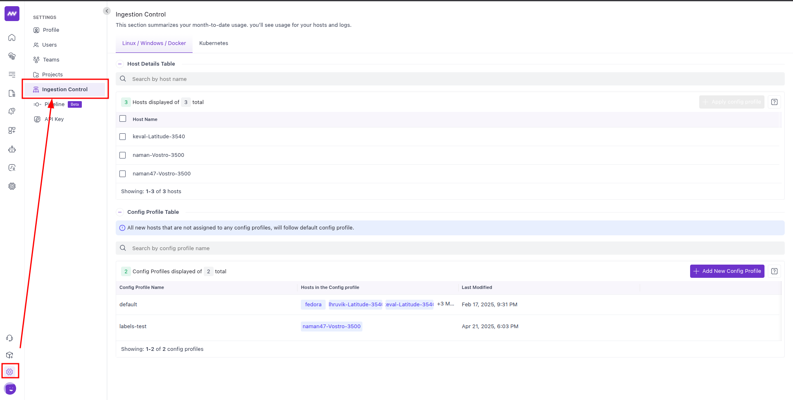
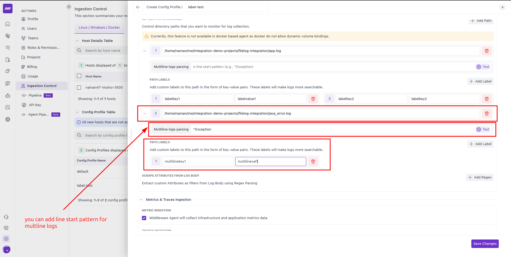

# Combined Log Generator

A Python script that combines the functionality of both shell scripts:

1. Generates application logs similar to the first script (loggen.sh)
2. Generates Java-style error logs similar to the second script (loggenmultiline.sh)
3. Runs both log generators concurrently using threads

## Features:

- Maintains the same log formats and generation rates as the original scripts
- Application logs are generated at 2 per second
- Java error logs are generated every 2 seconds
- Command-line options to customize log file paths
- Ability to disable either log generator if needed
- Progress reporting at regular intervals
- Graceful shutdown with Ctrl+C

## Usage Examples:

Run with default settings:
```bash
python3 combined_log_generator.py
```

Specify custom log file paths:
```bash
python3 combined_log_generator.py --app-log /path/to/application.log --error-log /path/to/errors.log
```

Generate only application logs:
```bash
python3 combined_log_generator.py --no-error-logs
```

Generate only Java(Multiline) error logs:
```bash
python3 combined_log_generator.py --no-app-logs
```

Get help with all options:
```bash
python3 combined_log_generator.py --help
```

# Ingestion Control

The following guide contains how to test the adding label functionality for filelogs. 

### Adding custom paths for logs
The Filelog Receiver is a component within the OpenTelemetry Collector that tails and parses logs from files. Middleware's 
ingestion control feature allows users to specify such files. 

To use this feature go to `settings->Ingestion Control`


#### Understanding config profiles

Config profiles are like classes. You can create these profiles that has settings and you 'apply' these profiles to your 
hosts or clusters.

So lets create a class called `label-test` where we will be generating logs and adding labels as log-attributes to them.


Adding paths, labels and multiline start patterns.





Applying the config profile to the host.
